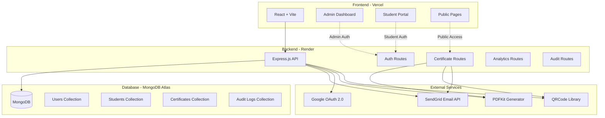

# 🎓 CertifyHub - Certificate Verification System

A full-stack MERN application for issuing, managing, and verifying internship certificates with QR code authentication, email automation, and public portfolio sharing.

[](https://mega-project-6-certificate-verifica.vercel.app)
[](https://mega-project-6-certificate-verification.onrender.com)
[](LICENSE)

---

## 🌟 Features

### 👨‍💼 Admin Dashboard
- **Bulk Certificate Issuance**: Upload student data via Excel/CSV and generate certificates in batch
- **Certificate Management**: View, search, edit, and delete certificates
- **Analytics Dashboard**: Track certificate views, downloads, and issuance trends with interactive charts
- **Audit Logging**: Complete activity tracking for security and compliance
- **Swagger API Documentation**: Interactive API testing interface

### 🎓 Student Portal
- **Dual Authentication**: Login via email/password or Google OAuth
- **Personal Portfolio**: View all earned certificates in one place
- **Public Profile Sharing**: Generate shareable links to showcase verified credentials
- **LinkedIn Integration**: One-click sharing to LinkedIn with certificate verification link
- **Password Recovery**: Secure email-based password reset flow

### 🔍 Public Verification
- **QR Code Scanning**: Instant certificate verification via QR code
- **Certificate ID Search**: Verify authenticity using unique certificate IDs
- **Public Profiles**: View student portfolios without authentication

---

## 🏗️ System Architecture



### Tech Stack

**Frontend:**
- React 18 with Vite
- React Router v6
- Axios for API calls
- Recharts for analytics
- Lucide React for icons
- Vanilla CSS with premium design system

**Backend:**
- Node.js + Express.js
- MongoDB with Mongoose ODM
- JWT authentication
- Google OAuth 2.0
- SendGrid Web API
- PDFKit for certificate generation
- QRCode for verification codes
- Helmet + Rate Limiting for security
- Swagger for API documentation

**DevOps:**
- Frontend: Vercel (Auto-deploy from GitHub)
- Backend: Render (Free tier)
- Database: MongoDB Atlas (Shared cluster)
- Email: SendGrid (Free tier - 100 emails/day)

---

## 📧 Email Delivery Notice

> **⚠️ Important:** Emails may land in **Spam/Junk** folders due to SendGrid's free tier limitations:
> - Free tier lacks dedicated IP address
> - Domain authentication (SPF/DKIM) not fully configured
> - Low sender reputation on shared IPs
>
> **For Production:** Upgrade to SendGrid paid plan and configure custom domain authentication.

---

## 🚀 Quick Start

### Prerequisites
- Node.js 18+ and npm
- MongoDB Atlas account
- SendGrid API key
- Google OAuth credentials (optional)

### Local Development

1. **Clone the repository**
```bash
git clone https://github.com/SaurabhBiswal/MEGA-PROJECT-6-CERTIFICATE-VERIFICATION-SYSTEM.git
cd MEGA-PROJECT-6-CERTIFICATE-VERIFICATION-SYSTEM
```

2. **Backend Setup**
```bash
cd server
npm install
```

Create `server/.env`:
```env
MONGODB_URI=your_mongodb_connection_string
JWT_SECRET=your_secret_key
GOOGLE_CLIENT_ID=your_google_client_id
GOOGLE_CLIENT_SECRET=your_google_client_secret
SENDGRID_API_KEY=your_sendgrid_api_key
EMAIL_FROM=your_verified_sender_email
EMAIL_NAME=CertifyHub
CLIENT_URL=http://localhost:5173
PORT=5000
```

Seed admin user:
```bash
node seedAdmin.js
```

Start backend:
```bash
node index.js
```

3. **Frontend Setup**
```bash
cd ../client
npm install
```

Create `client/.env`:
```env
VITE_API_URL=http://localhost:5000
VITE_CLIENT_URL=http://localhost:5173
VITE_GOOGLE_CLIENT_ID=your_google_client_id
```

Start frontend:
```bash
npm run dev
```

4. **Access the application**
- Frontend: http://localhost:5173
- Backend API: http://localhost:5000
- Swagger Docs: http://localhost:5000/api-docs

**Default Admin Credentials:**
- Email: `admin@certifyhub.com`
- Password: `admin123`

---

## 📦 Deployment

### Backend (Render)
1. Create new Web Service
2. Connect GitHub repository
3. Set build command: `npm install`
4. Set start command: `node index.js`
5. Add environment variables (see `.env` example above)

### Frontend (Vercel)
1. Import GitHub repository
2. Framework: Vite
3. Build command: `npm run build`
4. Output directory: `dist`
5. Add environment variables (see `client/.env` example)

### Post-Deployment
- Update `CLIENT_URL` in Render to Vercel deployment URL
- Update `VITE_API_URL` in Vercel to Render deployment URL
- Add Vercel URL to Google OAuth redirect URIs

---

## 📖 API Documentation

Interactive API documentation available at `/api-docs` endpoint.

### Key Endpoints

**Authentication**
- `POST /api/auth/login` - Admin login
- `POST /api/students/login` - Student login
- `POST /api/students/google-login` - Google OAuth login
- `POST /api/students/forgot-password` - Request password reset

**Certificates**
- `POST /api/certificates/bulk` - Bulk upload via Excel
- `GET /api/certificates` - List all certificates
- `GET /api/certificates/verify/:id` - Verify certificate
- `GET /api/certificates/download/:id` - Download PDF

**Students**
- `GET /api/students/me` - Get logged-in student's certificates
- `GET /api/students/public/:id` - Public profile view

**Analytics**
- `GET /api/analytics/stats` - Dashboard statistics
- `GET /api/analytics/trends` - Issuance trends

---

## 🎨 Features Showcase

### Certificate Generation
- Auto-generated unique IDs (e.g., `CH-7D1H56OT`)
- QR code with verification link
- Professional PDF design
- Automatic email delivery with attachment

### Security
- JWT-based authentication
- Password hashing with bcrypt
- Rate limiting (100 requests/15 min)
- Helmet.js security headers
- Audit logging for all critical actions

### User Experience
- Responsive design (mobile-first)
- Premium glassmorphism UI
- Real-time search and filtering
- Interactive charts (Recharts)
- Toast notifications

---

## 🤝 Contributing

Contributions are welcome! Please follow these steps:
1. Fork the repository
2. Create a feature branch (`git checkout -b feature/AmazingFeature`)
3. Commit changes (`git commit -m 'Add AmazingFeature'`)
4. Push to branch (`git push origin feature/AmazingFeature`)
5. Open a Pull Request

---

## 📄 License

This project is licensed under the MIT License - see the [LICENSE](LICENSE) file for details.

---

## 👨‍💻 Author

**Saurabh Biswal**
- GitHub: [@SaurabhBiswal](https://github.com/SaurabhBiswal)
- Email: punpunsaurabh2002@gmail.com

---

## 🙏 Acknowledgments

- MongoDB Atlas for database hosting
- Render for backend deployment
- Vercel for frontend hosting
- SendGrid for email delivery
- Google for OAuth services

---

## 📞 Support

For issues and questions:
- Open an issue on GitHub
- Email: punpunsaurabh2002@gmail.com

---

**⭐ Star this repository if you found it helpful!**
